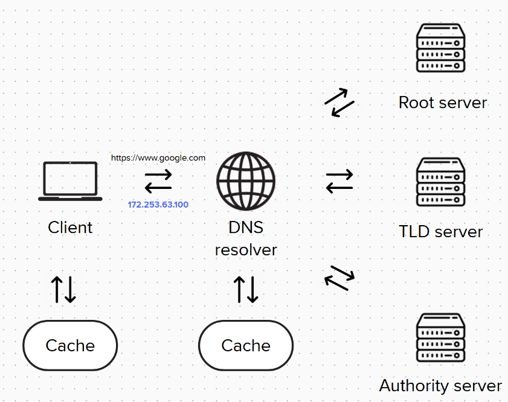
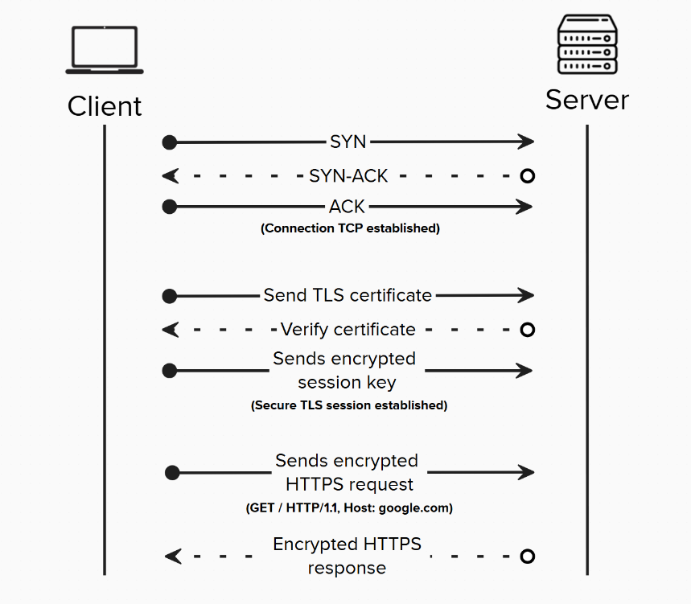
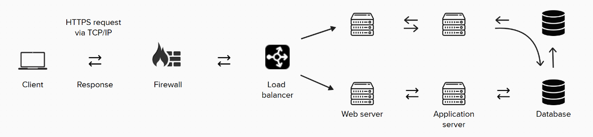
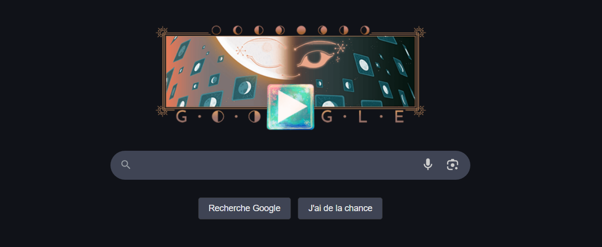

Let’s walk through what actually happens, step by step, when you enter a URL like `https://www.google.com` into your browser and hit Enter.

---

## 1. URL Breakdown


When you type a URL, it consists of several components. In this case, `https` is the protocol or scheme. It's an application-layer protocol that defines how communication between the browser (client) and the server takes place. `HTTPS` is a secure version of HTTP, enhanced with `TLS` (Transport Layer Security), which provides encryption. This ensures that the data transmitted remains private and cannot be tampered with.

The `www` part is a subdomain. It usually refers to the public-facing part of a website, although it’s not strictly required. The domain name `google.com` is what humans use to identify the website. It consists of `google`, the second-level domain, and `.com`, the top-level domain (TLD).

---

## 2. DNS Resolution: Finding the IP Address



Before connecting to Google’s servers, your browser needs to translate the human-readable domain name (`www.google.com`) into an IP address (like `142.250.74.68`), which computers understand. First, it checks its local DNS cache to see if the address has been previously resolved. If not, it asks a DNS resolver (often provided by your internet service provider).

The resolver then queries a hierarchy of DNS servers: first a **root server**, then a **TLD server** (responsible for `.com` domains), and finally the **authoritative server** for `google.com`. Once the correct IP address is found, the browser is ready to initiate a connection.

---

## 3. Establishing a TCP Connection

To communicate reliably, the browser uses the **TCP (Transmission Control Protocol)** to establish a connection with the server on **port 443**, which is standard for HTTPS. This connection process is called the **3-way handshake**, consisting of three steps:

- The browser sends a **SYN** message to request a connection  
- The server responds with a **SYN-ACK** message to acknowledge  
- The browser replies with an **ACK**, confirming the connection

Once this handshake is complete, the browser and server can start exchanging data.

---

## 4. TLS Handshake: Securing the Communication

Before any real data is transmitted, the browser and server perform a **TLS handshake** to secure the connection. The server sends its **SSL/TLS certificate** to prove its identity. The browser verifies this certificate using a list of trusted certificate authorities.

If the certificate is valid, the browser generates a **session key**, which is then securely exchanged with the server. This key is used to **encrypt all future communication**, ensuring privacy and preventing tampering.

---

## 5. Sending the HTTPS Request

Now that the connection is secure, the browser sends a **HTTPS request**. A typical example might look like this:

```vbnet
GET / HTTP/1.1  
Host: www.google.com
```



This request is encrypted with TLS, then wrapped in TCP/IP packets and sent to Google’s server.

---

Here's a simplified diagram of server interaction



## 6. Load Balancing

Google uses a **load balancer** to manage massive amounts of incoming traffic. When your request arrives, the load balancer decides which backend server should handle it. This helps distribute traffic evenly, ensures reliability, and improves performance. The request may also be routed through a **Content Delivery Network (CDN)** to a server geographically closer to you, reducing latency.

---

## 7. Web Server Handling

The request is received by a **web server**, such as Nginx or Apache. The web server reads and processes the HTTP request: checking the method, headers, and cookies. If it’s a simple static file (like an image or HTML page), it can respond directly. Otherwise, it forwards the request to the **application server** for more complex processing.

---

## 8. Application Server Processing

When dynamic logic is involved (like performing a Google search), the request is passed to an **application server**, which may be written in Node.js, Python, Java, or another language. This server handles the core logic of the application—processing data, managing sessions, and interacting with databases if needed.

---

## 9. Database Query

If the application requires data—like search results, user information, or content—it sends a query to a **database** such as MySQL, PostgreSQL, or MongoDB. The database processes the request and returns the necessary data to the application server.

---

## 10. Returning the HTTP Response

Once the application server has the required data, it builds the response. The data is sent back to the **web server**, which formats it into a standard **HTTP response**—typically HTML content. This response is then encrypted using TLS and sent back through the **TCP/IP connection** to the browser.

---

## 11. Browser Rendering

When the browser receives the HTTP response, it begins **rendering the page**. It parses the HTML, downloads any linked resources (like CSS stylesheets, JavaScript files, and images), and constructs the **DOM (Document Object Model)**.

Once the layout is built and styles and scripts are applied, the final web page is displayed to you.


---

✅ And that’s everything that happens—from the moment you hit Enter to when you see Google’s homepage.
